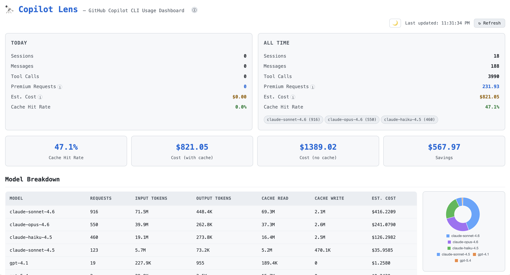

# copilot-lens 🔍

🔭 Local dashboard for visualizing **GitHub Copilot CLI** usage — sessions, token counts, cost estimates, tool analytics & more. Zero-install, privacy-first — your data never leaves your machine.



Inspired by [claude-lens](https://github.com/foyzulkarim/claude-lens).

## Quick Start

### ⚡ Zero-install (recommended)

```bash
npx github:abdur-rakib/copilot-lens
```

Open **http://localhost:3456** in your browser. That's it — no cloning, no `npm install`.

### 🛠 Manual install

```bash
git clone https://github.com/abdur-rakib/copilot-lens.git
cd copilot-lens && npm install && npm start
```

Open **http://localhost:3456** in your browser.

### ⚙️ Custom port or Copilot directory

```bash
PORT=4000 npx github:abdur-rakib/copilot-lens
# or
COPILOT_DIR=/custom/path npx github:abdur-rakib/copilot-lens
```

## What You'll See

| Section              | Description                                                 |
| -------------------- | ----------------------------------------------------------- |
| **Today / All-Time** | Sessions, messages, tool calls, premium requests, est. cost |
| **Cache Analytics**  | Hit rate, cost with/without cache, total savings            |
| **Daily Breakdown**  | Per-day table of all metrics                                |
| **Tool Analytics**   | Bar chart of tool usage with drill-down details             |
| **Projects**         | Activity grouped by repository                              |
| **Command History**  | Recent Copilot CLI commands                                 |

## Configuration

Copy `.env.example` to `.env` to customise:

| Variable            | Default      | Description                     |
| ------------------- | ------------ | ------------------------------- |
| `COPILOT_DIR`       | `~/.copilot` | Path to Copilot state directory |
| `PORT`              | `3456`       | Server port                     |
| `RATE_INPUT`        | `5.0`        | $/1M input tokens               |
| `RATE_OUTPUT`       | `25.0`       | $/1M output tokens              |
| `RATE_CACHE_READ`   | `0.5`        | $/1M cache-read tokens          |
| `RATE_CACHE_CREATE` | `6.25`       | $/1M cache-create tokens        |

Default rates reflect **AWS Bedrock cross-region (ap-southeast-2)** pricing.

> ⚠️ These rates are estimates. They do not reflect your actual GitHub Copilot subscription cost. Adjust to match your actual cloud provider pricing tier.

## How It Works

copilot-lens reads data directly from `~/.copilot/session-state/`:

### Data Sources

```
~/.copilot/session-state/<uuid>/
  ├── workspace.yaml              → project name, branch, cwd, timestamps
  ├── events.jsonl                → token counts, tool calls, premium requests
  │     event types used:
  │       session.shutdown        → aggregated token/cost/request totals
  │       user.message            → message count per session
  │       tool.execution_start    → tool call count + arguments
  │       tool.execution_complete → success/failure status per tool call
  └── (session.db — SQLite conversation store, not read by copilot-lens)

~/.copilot/command-history-state.json → CLI command history (string array)
```

### Example: `session.shutdown` event

This is the key analytics event — written by Copilot CLI at the end of every session:

```json
{
  "type": "session.shutdown",
  "timestamp": "2026-05-04T10:23:45.000Z",
  "data": {
    "totalPremiumRequests": 3.67,
    "totalApiDurationMs": 45230,
    "modelMetrics": {
      "claude-sonnet-4.6": {
        "requests": { "count": 12, "cost": 0.42 },
        "usage": {
          "inputTokens": 18420,
          "outputTokens": 3210,
          "cacheReadTokens": 62000,
          "cacheWriteTokens": 9800,
          "reasoningTokens": 0
        }
      }
    },
    "codeChanges": { "linesAdded": 84, "linesRemoved": 12, "filesModified": 3 }
  }
}
```

All processing happens locally. No data is sent anywhere.

## How Costs Are Calculated

### Premium Requests

Premium requests are **recorded by Copilot CLI itself** — not calculated by copilot-lens.
Each session ends with a `session.shutdown` event containing `totalPremiumRequests` (a float).
copilot-lens sums these values across all sessions.

Different models consume different premium request weights:

- `claude-opus-4.x` ≈ 3 premium requests per API call
- `claude-sonnet-4.x` ≈ 1 premium request per API call
- `gpt-4.1` ≈ 0 premium requests (included in base plan)

### Estimated USD Cost

USD cost is an **estimate** computed from raw token counts × configurable per-token rates:

```
cost = (inputTokens      × RATE_INPUT / 1,000,000)
     + (outputTokens     × RATE_OUTPUT / 1,000,000)
     + (cacheReadTokens  × RATE_CACHE_READ / 1,000,000)
     + (cacheWriteTokens × RATE_CACHE_CREATE / 1,000,000)
```

> ⚠️ This is **not** your actual GitHub Copilot subscription cost — it is an approximation for awareness based on underlying model API pricing. Override rates in `.env` to match your actual cloud provider.

## Architecture

Two files:

- `server.js` — Express API server (7 endpoints)
- `index.html` — Single-page dashboard (HTML + CSS + JS)

Dependencies: `express`, `dotenv` — that's it.

## API Endpoints

| Endpoint                          | Returns                                |
| --------------------------------- | -------------------------------------- |
| `GET /api/stats`                  | Aggregate statistics                   |
| `GET /api/sessions`               | Session list with metadata             |
| `GET /api/history`                | Command history                        |
| `GET /api/daily-costs`            | Per-day breakdown with token/cost data |
| `GET /api/projects`               | Project-level aggregation              |
| `GET /api/tool-calls`             | Tool usage counts                      |
| `GET /api/tool-details/:toolName` | Detailed calls for a specific tool     |

## License

MIT
